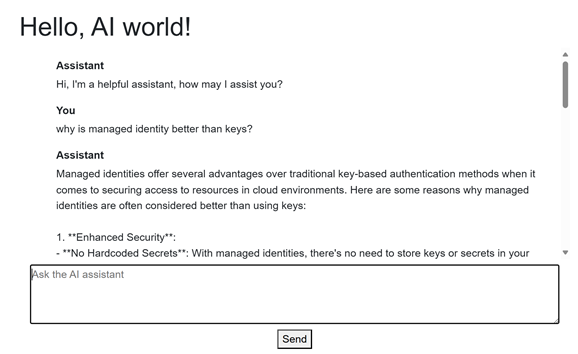

# Chat Application using Azure OpenAI (C#/.NET)

[](https://codespaces.new/Azure-Samples/ai-chat-quickstart-csharp)
[](https://vscode.dev/redirect?url=vscode://ms-vscode-remote.remote-containers/cloneInVolume?url=https://github.com/azure-samples/ai-chat-quickstart-csharp)

This repository includes a .NET/C# app that uses Azure OpenAI to generate responses to user messages.

The project includes all the infrastructure and configuration needed to provision Azure OpenAI resources and deploy the app to [Azure Container Apps](https://learn.microsoft.com/azure/container-apps/overview) using the [Azure Developer CLI](https://learn.microsoft.com/azure/developer/azure-developer-cli/overview). By default, the app will use managed identity to authenticate with Azure OpenAI.

We recommend first going through the [deploying steps](#deploying) before running this app locally,
since the local app needs credentials for Azure OpenAI to work properly.

* [Features](#features)
* [Architecture diagram](#architecture-diagram)
* [Getting started](#getting-started)
  * [Local Environment - Visual Studio or VS Code](#local-environment)
  * [GitHub Codespaces](#github-codespaces)
  * [VS Code Dev Containers](#vs-code-dev-containers)
* [Deploying](#deploying)
* [Development server](#development-server)
* [Guidance](#guidance)
  * [Costs](#costs)
  * [Security Guidelines](#security-guidelines)
* [Resources](#resources)

## Features

* An [ASP.NET Core](https://dotnet.microsoft.com/en-us/apps/aspnet) that uses [Semantic Kernel](https://learn.microsoft.com/en-us/semantic-kernel/overview/) package to access language models to generate responses to user messages.
* A basic HTML/JS frontend that streams responses from the backend using JSON over a [ReadableStream](https://developer.mozilla.org/en-US/docs/Web/API/ReadableStream).
* A Blazor frontend that streams responses from the backend.
* [Bicep files](https://docs.microsoft.com/azure/azure-resource-manager/bicep/) for provisioning Azure resources, including Azure OpenAI, Azure Container Apps, Azure Container Registry, Azure Log Analytics, and RBAC roles.
* Using the OpenAI gpt-4o-mini model through Azure OpenAI.
* Support for using [local LLMs](/docs/local_ollama.md) or GitHub Models during development.



## Architecture diagram


## Getting started

You have a few options for getting started with this template.
The quickest way to get started is GitHub Codespaces, since it will setup all the tools for you, but you can also [set it up locally](#local-environment).

### GitHub Codespaces

You can run this template virtually by using GitHub Codespaces. The button will open a web-based VS Code instance in your browser:

1. Open the template (this may take several minutes):

    [](https://codespaces.new/Azure-Samples/ai-chat-quickstart-csharp)

2. Open a terminal window
3. Continue with the [deploying steps](#deploying)

### Local Environment

If you're not using one of the above options for opening the project, then you'll need to:

1. Make sure the following tools are installed:

    * [.NET 8](https://dotnet.microsoft.com/downloads/)
    * [Git](https://git-scm.com/downloads)
    * [Azure Developer CLI (azd)](https://aka.ms/install-azd)
    * [VS Code](https://code.visualstudio.com/Download) or [Visual Studio](https://visualstudio.microsoft.com/downloads/)
        * If using VS Code, install the [C# Dev Kit](https://marketplace.visualstudio.com/items?itemName=ms-dotnettools.csdevkit)

2. Download the project code:

    ```shell
    azd init -t ai-chat-quickstart-csharp
    ```

3. If you're using Visual Studio, open the src/ai-chat-quickstart.sln solution file. If you're using VS Code, open the src folder.

7. Continue with the [deploying steps](#deploying).

### VS Code Dev Containers

A related option is VS Code Dev Containers, which will open the project in your local VS Code using the [Dev Containers extension](https://marketplace.visualstudio.com/items?itemName=ms-vscode-remote.remote-containers):

1. Start Docker Desktop (install it if not already installed)
2. Open the project:

    [](https://vscode.dev/redirect?url=vscode://ms-vscode-remote.remote-containers/cloneInVolume?url=https://github.com/azure-samples/ai-chat-quickstart-csharp)

3. In the VS Code window that opens, once the project files show up (this may take several minutes), open a terminal window.

4. Continue with the [deploying steps](#deploying)


## Deploying

Once you've opened the project in [Codespaces](#github-codespaces), in [Dev Containers](#vs-code-dev-containers), or [locally](#local-environment), you can deploy it to Azure.

### Azure account setup

1. Sign up for a [free Azure account](https://azure.microsoft.com/free/) and create an Azure Subscription.
2. Check that you have the necessary permissions:

    * Your Azure account must have `Microsoft.Authorization/roleAssignments/write` permissions, such as [Role Based Access Control Administrator](https://learn.microsoft.com/azure/role-based-access-control/built-in-roles#role-based-access-control-administrator-preview), [User Access Administrator](https://learn.microsoft.com/azure/role-based-access-control/built-in-roles#user-access-administrator), or [Owner](https://learn.microsoft.com/azure/role-based-access-control/built-in-roles#owner). If you don't have subscription-level permissions, you must be granted [RBAC](https://learn.microsoft.com/azure/role-based-access-control/built-in-roles#role-based-access-control-administrator-preview) for an existing resource group and [deploy to that existing group](/docs/deploy_existing.md#resource-group).
    * Your Azure account also needs `Microsoft.Resources/deployments/write` permissions on the subscription level.

### Deploying with azd

From a Terminal window, open the folder with the clone of this repo and run the following commands.

1. Login to Azure:

    ```shell
    azd auth login
    ```

2. Provision and deploy all the resources:

    ```shell
    azd up
    ```

    It will prompt you to provide an `azd` environment name (like "chat-app"), select a subscription from your Azure account, and select a [location where OpenAI is available](https://azure.microsoft.com/explore/global-infrastructure/products-by-region/?products=cognitive-services&regions=all) (like "francecentral"). Then it will provision the resources in your account and deploy the latest code. If you get an error or timeout with deployment, changing the location can help, as there may be availability constraints for the OpenAI resource.

3. When `azd` has finished deploying, you'll see an endpoint URI in the command output. Visit that URI, and you should see the chat app! 🎉

4. When you've made any changes to the app code, you can just run:

    ```shell
    azd deploy
    ```

### Continuous deployment with GitHub Actions

This project includes a Github workflow for deploying the resources to Azure
on every push to main. That workflow requires several Azure-related authentication secrets
to be stored as Github action secrets. To set that up, run:

```shell
azd pipeline config
```

## Development server

In order to run this app, you need to either have an Azure OpenAI account deployed (from the [deploying steps](#deploying)), use a model from [GitHub models](https://github.com/marketplace/models), use the [Azure AI Model Catalog](https://learn.microsoft.com/en-us/azure/machine-learning/concept-model-catalog?view=azureml-api-2), or use a [local LLM server](/docs/local_ollama.md).

After deployment, Azure OpenAI is configured for you using [User Secrets](https://learn.microsoft.com/en-us/aspnet/core/security/app-secrets). If you could not run the deployment steps here, or you want to use different models, you can manually update the settings in `appsettings.local.json`. **Important:** This file is only for local development and this sample includes it in the `.gitignore` file so changes to it will be ignored. Do not check your secure keys into source control!

1. If you want to use an existing Azure OpenAI deployment, you modify the `AZURE_OPENAI_ENDPOINT` and `AZURE_OPENAI_DEPLOYMENT` configuration settings in the `appsettings.local.json` file. 

2. For use with GitHub models, change `AIHost` to "github" in the `appsettings.local.json` file.

    You'll need a `GITHUB_TOKEN` environment variable that stores a GitHub personal access token.
    If you're running this inside a GitHub Codespace, the token will be automatically available.
    If not, generate a new [personal access token](https://github.com/settings/tokens) and configure it in the `GITHUB_TOKEN` setting of `appsettings.local.json`:

3. For use with local models, change `AIHost` to "local" in the `appsettings.local.json` file and change `LOCAL_MODELS_ENDPOINT` and `LOCAL_MODELS_NAME` to match the local server. See [local LLM server](/docs/local_ollama.md) for more information.

4. To use the Azure AI Model Catalog, change `AIHost` to "azureAIModelCatalog" in the `appsettings.local.json` file. Change `AZURE_INFERENCE_KEY`, `AZURE_MODEL_NAME`, and `AZURE_MODEL_ENDPOINT` settings to match your configuration in the Azure AI Model Catalog.

4. Start the project:

    **If using Visual Studio**, choose the `Debug > Start Debugging` menu.
    **If using VS Code or GitHub CodeSpaces***, choose the `Run > Start Debugging` menu.
    Finally, if using the command line, run the following from the project directory:

    ```shell
    dotnet run
    ```

    This will start the app on port 5153, and you can access it at `http://localhost:5153`.

## Guidance

### Costs

Pricing varies per region and usage, so it isn't possible to predict exact costs for your usage.
The majority of the Azure resources used in this infrastructure are on usage-based pricing tiers.
However, Azure Container Registry has a fixed cost per registry per day.

You can try the [Azure pricing calculator](https://azure.com/e/2176802ea14941e4959eae8ad335aeb5) for the resources:

* Azure OpenAI Service: S0 tier, gpt-4o-mini model. Pricing is based on token count. [Pricing](https://azure.microsoft.com/pricing/details/cognitive-services/openai-service/)
* Azure Container App: Consumption tier with 0.5 CPU, 1GiB memory/storage. Pricing is based on resource allocation, and each month allows for a certain amount of free usage. [Pricing](https://azure.microsoft.com/pricing/details/container-apps/)
* Azure Container Registry: Basic tier. [Pricing](https://azure.microsoft.com/pricing/details/container-registry/)
* Log analytics: Pay-as-you-go tier. Costs based on data ingested. [Pricing](https://azure.microsoft.com/pricing/details/monitor/)

⚠️ To avoid unnecessary costs, remember to take down your app if it's no longer in use,
either by deleting the resource group in the Portal or running `azd down`.

### Security Guidelines

This template uses [Managed Identity](https://learn.microsoft.com/entra/identity/managed-identities-azure-resources/overview) for authenticating to the Azure OpenAI service.

Additionally, we have added a [GitHub Action](https://github.com/microsoft/security-devops-action) that scans the infrastructure-as-code files and generates a report containing any detected issues. To ensure continued best practices in your own repository, we recommend that anyone creating solutions based on our templates ensure that the [Github secret scanning](https://docs.github.com/code-security/secret-scanning/about-secret-scanning) setting is enabled.

You may want to consider additional security measures, such as:

* Protecting the Azure Container Apps instance with a [firewall](https://learn.microsoft.com/azure/container-apps/waf-app-gateway) and/or [Virtual Network](https://learn.microsoft.com/azure/container-apps/networking?tabs=workload-profiles-env%2Cazure-cli).

## Resources

* [RAG chat with Azure AI Search + C#/.NET](https://github.com/Azure-Samples/azure-search-openai-demo-csharp/): A more advanced chat app that uses Azure AI Search to ground responses in domain knowledge. Includes user authentication with Microsoft Entra as well as data access controls.
* [Develop .NET Apps with AI Features](https://learn.microsoft.com/en-us/dotnet/ai/get-started/dotnet-ai-overview)
